# 水果店进销存系统 - 数据库 ER 图

## 概述

本系统采用关系型数据库 MySQL 存储数据，共包含 18 个核心表，支持多门店、多用户、完整的进销存业务流程。

---

## ER 图 (Mermaid)

```mermaid
erDiagram
    %% ==================== 用户与门店 ====================
    USERS ||--o{ USER_STORES : "拥有"
    STORES ||--o{ USER_STORES : "分配给"
    
    USERS {
        varchar username PK "用户名(主键)"
        varchar password "密码"
        varchar name "姓名"
        varchar role "角色"
        varchar email "邮箱"
    }
    
    STORES {
        varchar id PK "门店ID"
        varchar name "门店名称"
        varchar city "城市"
        varchar code "门店编码"
        varchar address "地址"
        varchar phone "电话"
    }
    
    USER_STORES {
        varchar username FK "用户名"
        varchar store_id FK "门店ID"
    }

    %% ==================== 商品管理 ====================
    PRODUCTS ||--o{ PRODUCT_TAGS : "拥有"
    PRODUCTS ||--o{ INVENTORY : "对应"
    
    PRODUCTS {
        varchar id PK "商品ID"
        varchar name "商品名称"
        varchar category "分类"
        varchar barcode "条码"
        varchar spec "规格"
        varchar unit "单位"
        decimal tax_rate "税率"
        decimal price_base "基准价"
        varchar status "状态"
    }
    
    PRODUCT_TAGS {
        varchar product_id FK "商品ID"
        varchar tag "标签"
    }

    %% ==================== 合作伙伴 ====================
    PARTNERS ||--o{ PURCHASE_ORDERS : "供货"
    PARTNERS ||--o{ SALES_ORDERS : "购买"
    
    PARTNERS {
        varchar id PK "合作伙伴ID"
        varchar type "类型(SUPPLIER/CUSTOMER)"
        varchar name "名称"
        varchar contact_name "联系人"
        varchar phone "电话"
        int payment_term_days "账期天数"
        decimal outstanding_amount "应收/应付余额"
        varchar status "状态"
    }

    %% ==================== 库存管理 ====================
    STORES ||--o{ INVENTORY : "拥有"
    INVENTORY ||--o{ ADJUSTMENTS : "调整"
    
    INVENTORY {
        varchar id PK "库存ID"
        varchar store_id FK "门店ID"
        varchar product_id FK "商品ID"
        varchar fruit "水果名称"
        decimal on_hand_kg "库存量(kg)"
        decimal unit_cost "单位成本"
        decimal unit_price "售价"
        decimal reorder_level_kg "预警线"
    }
    
    ADJUSTMENTS {
        varchar id PK "调整ID"
        varchar inventory_id FK "库存ID"
        varchar reason "调整原因"
        decimal delta_kg "调整量"
        varchar created_by "操作人"
        datetime created_at "操作时间"
    }

    %% ==================== 采购管理 ====================
    STORES ||--o{ PURCHASE_ORDERS : "采购"
    PURCHASE_ORDERS ||--o{ PURCHASE_ORDER_LINES : "包含"
    PURCHASE_ORDERS ||--o{ PURCHASE_TIMELINE_EVENTS : "记录"
    
    PURCHASE_ORDERS {
        varchar id PK "采购单ID"
        varchar store_id FK "门店ID"
        varchar supplier_id FK "供应商ID"
        varchar status "状态"
        date expected_date "预计到货日"
        int payment_term_days "账期"
    }
    
    PURCHASE_ORDER_LINES {
        bigint id PK "行ID"
        varchar purchase_order_id FK "采购单ID"
        varchar product_id "商品ID"
        varchar fruit "水果名称"
        decimal quantity_kg "数量(kg)"
        decimal unit_cost "单价"
    }

    %% ==================== 销售管理 ====================
    STORES ||--o{ SALES_ORDERS : "销售"
    SALES_ORDERS ||--o| INVOICES : "生成"
    
    SALES_ORDERS {
        varchar id PK "销售单ID"
        varchar store_id FK "门店ID"
        date date "日期"
        varchar customer "客户名"
        varchar customer_id FK "客户ID"
        varchar channel "渠道"
        decimal quantity_kg "数量"
        decimal unit_price "单价"
        varchar payment_method "支付方式"
        varchar status "状态"
    }

    %% ==================== 财务管理 ====================
    STORES ||--o{ INVOICES : "开具"
    
    INVOICES {
        varchar id PK "发票ID"
        varchar store_id FK "门店ID"
        varchar sales_order_id FK "销售单ID"
        date due_date "到期日"
        decimal amount "金额"
        varchar status "状态"
    }

    %% ==================== 会员管理 ====================
    MEMBERS {
        varchar id PK "会员ID"
        varchar name "姓名"
        varchar phone "电话"
        decimal balance "余额"
        decimal points "积分"
        int level "等级"
        varchar tier "会员类型"
        decimal total_spend "累计消费"
        date join_date "注册日期"
    }

    %% ==================== 系统配置 ====================
    ROLE_MATRIX ||--o{ ROLE_PERMISSIONS : "拥有"
    ROLE_MATRIX ||--o{ ROLE_DATA_DOMAINS : "管辖"
    
    ROLE_MATRIX {
        varchar role PK "角色代码"
        varchar label "角色名称"
    }
    
    SYSTEM_PARAMETERS {
        varchar param_key PK "参数键"
        varchar label "参数名"
        varchar param_value "参数值"
        varchar description "描述"
    }
    
    CHANNEL_CONFIGS {
        varchar id PK "渠道ID"
        varchar name "渠道名"
        boolean enabled "是否启用"
        decimal revenue_share "收入占比"
        decimal fee_rate "费率"
    }

    %% ==================== 审批与审计 ====================
    APPROVAL_FLOWS ||--o{ APPROVAL_STEPS : "包含"
    
    APPROVAL_FLOWS {
        varchar id PK "流程ID"
        varchar name "流程名"
        varchar document_type "单据类型"
        varchar trigger_condition "触发条件"
        boolean enabled "是否启用"
    }
    
    AUDIT_LOGS {
        varchar id PK "日志ID"
        varchar actor "操作人"
        varchar action "操作"
        varchar entity "实体"
        varchar entity_id "实体ID"
        text old_value "旧值"
        text new_value "新值"
        datetime timestamp "时间"
    }
```



---

## 表结构说明

### 核心业务表

| 表名 | 说明 | 主要字段 |
|------|------|----------|
| `stores` | 门店信息 | id, name, city, address |
| `users` | 用户账号 | username, password, role |
| `products` | 商品主数据 | id, name, category, price |
| `partners` | 供应商/客户 | id, type, name, payment_term |
| `inventory` | 库存记录 | store_id, product_id, on_hand_kg |
| `purchase_orders` | 采购订单 | store_id, supplier_id, status |
| `sales_orders` | 销售订单 | store_id, customer_id, amount |
| `invoices` | 发票 | sales_order_id, amount, status |
| `members` | 会员 | name, phone, points, balance |
| `adjustments` | 库存调整 | inventory_id, delta_kg, reason |

### 系统配置表

| 表名 | 说明 |
|------|------|
| `system_parameters` | 系统参数配置 |
| `role_matrix` | 角色权限定义 |
| `approval_flows` | 审批流程配置 |
| `channel_configs` | 销售渠道配置 |
| `integrations` | 外部集成配置 |
| `automations` | 自动化任务配置 |
| `audit_logs` | 操作审计日志 |
| `aging_buckets` | 账龄分析配置 |

---

## 关系说明

### 一对多关系
- **门店 → 库存**: 一个门店有多个库存记录
- **门店 → 采购单**: 一个门店有多个采购订单
- **门店 → 销售单**: 一个门店有多个销售订单
- **采购单 → 采购行**: 一个采购单包含多个明细行
- **商品 → 库存**: 一个商品在多个门店有库存

### 多对多关系
- **用户 ↔ 门店**: 通过 `user_stores` 关联表实现
- **角色 ↔ 权限**: 通过 `role_permissions` 关联表实现

---

## 数据库规范

### 命名规范
- 表名：小写下划线命名（snake_case）
- 主键：统一使用 `id` 或业务键（如 `username`）
- 外键：`{关联表}_id` 格式

### 字段类型
- ID 字段：`VARCHAR(50)` 支持 UUID
- 金额字段：`DECIMAL(12,2)` 精确到分
- 重量字段：`DECIMAL(12,2)` 精确到克
- 状态字段：`VARCHAR(20)` 枚举值
- 时间字段：`DATETIME` 或 `DATE`

### 索引策略
```sql
-- 已建立的索引
CREATE INDEX idx_inventory_store ON inventory(store_id);
CREATE INDEX idx_purchase_store ON purchase_orders(store_id);
CREATE INDEX idx_sales_store ON sales_orders(store_id);
CREATE INDEX idx_sales_date ON sales_orders(date);
CREATE INDEX idx_invoice_store ON invoices(store_id);
CREATE INDEX idx_member_phone ON members(phone);
CREATE INDEX idx_audit_timestamp ON audit_logs(timestamp);
```
